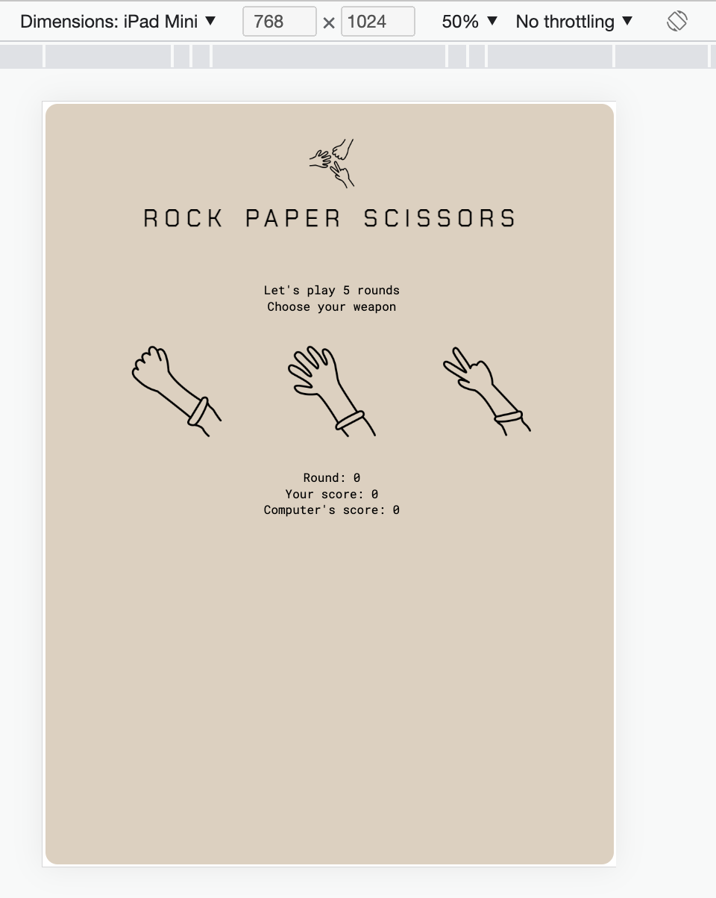

# Rock Paper Scissors
A simple Rock, Paper, Scissors game using Javascript

## Project brief
Creating a simple game of rock, paper, scissors using Javascript as an assigment from TheOdinProject

[More detailed instructions](https://www.theodinproject.com/lessons/foundations-rock-paper-scissors)

*Credit: Icons created by Josie Schultz from Noun Project*

## Outcome

## Development phases
#### Phase 1: create the basics
- create basic functions for the game: computer's random choices of rock/paper/scissors, logic of a single game round
- create function for the game:
    - a game has 5 rounds
    - take player's choices using `prompt` questions
- added scores for both player & computer

***So far, the game result is only visible using `console.log`***

### Phase 2: adding UI
- added HTML & CSS
- fixed functions in Javascript to correspond to UI elements --> game results now can be seen on the webpage
- fixed issues:
    - display final result after 5 rounds of game
    - added reset button
    - made rock/paper/scissors images unclickable after the game ends

### Phase 3: responsive page
- use @media query to make responsive design

Examples of finished page on different devices (demo on Developer Tools):

## Learning outcomes
- get used to basics of Javascript:
    - functions, loop, execution order
    - DOM manipulation
- fix issues to improve page's interaction

## Known limitations
- Design is not optimized on mobile screen landscape mode :slightly_frowning_face: